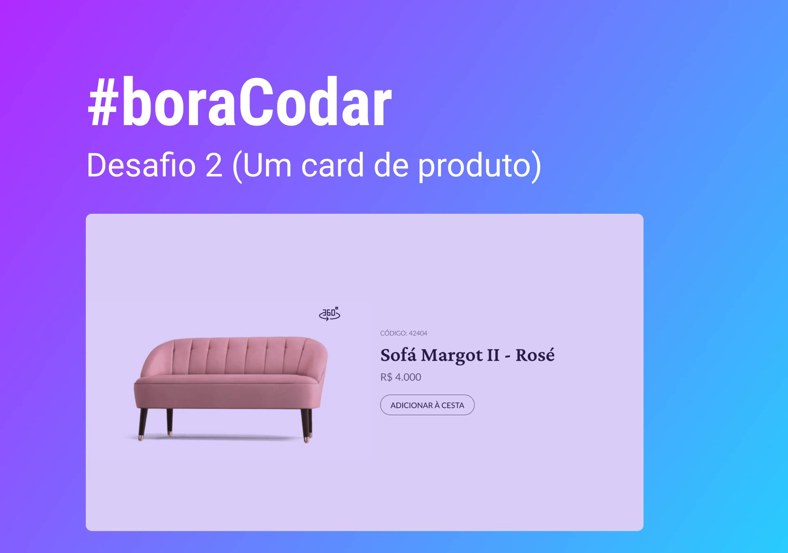
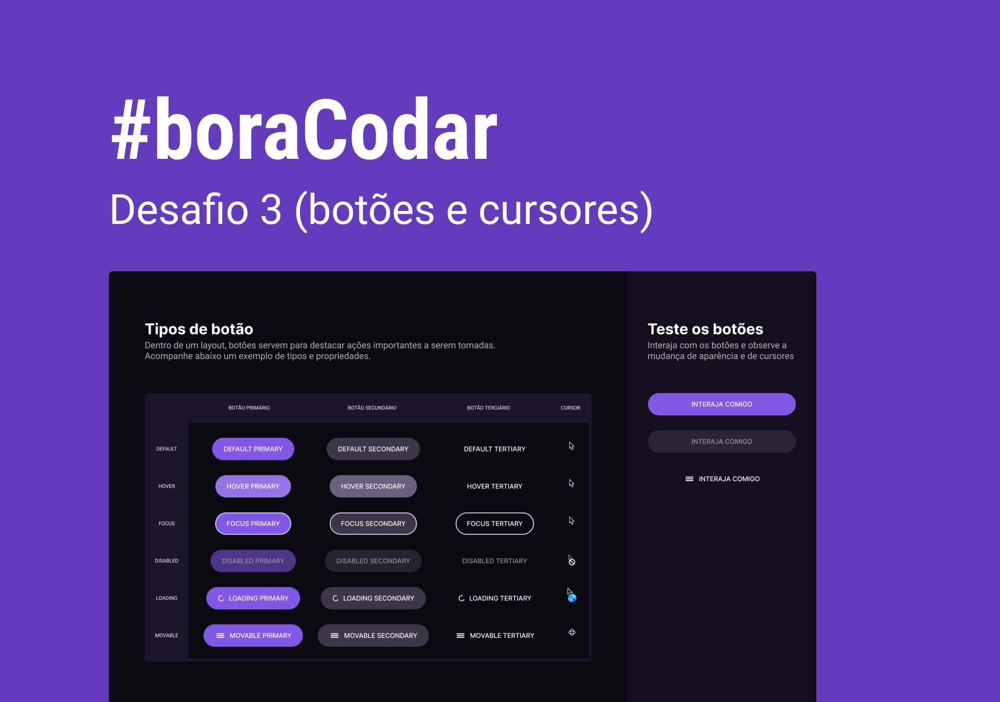
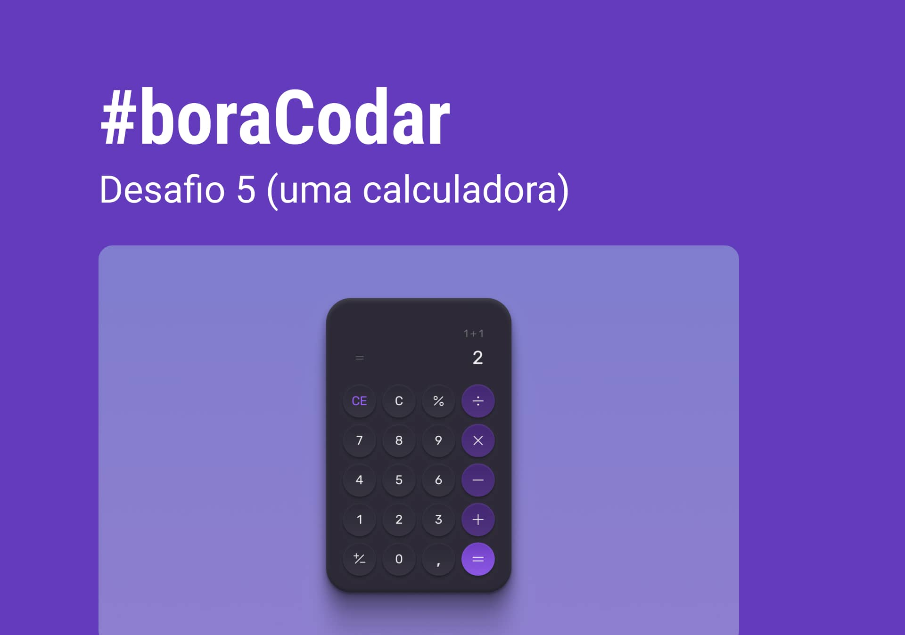
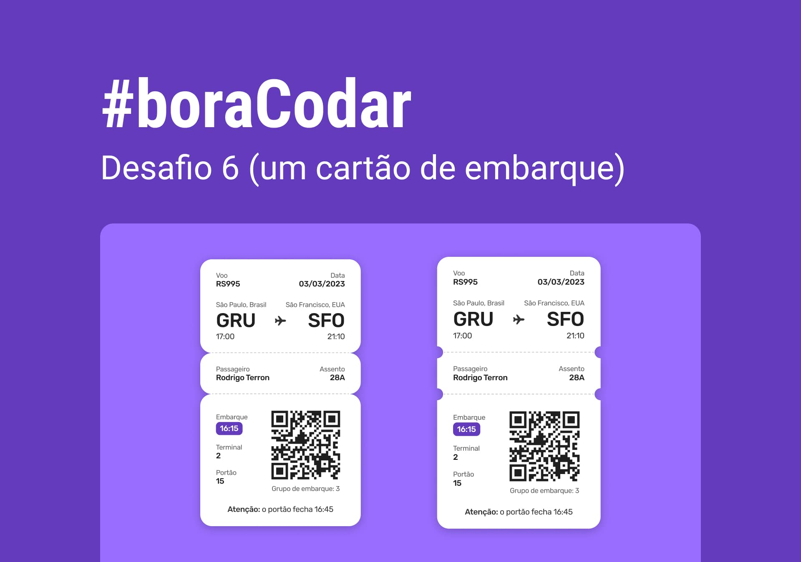
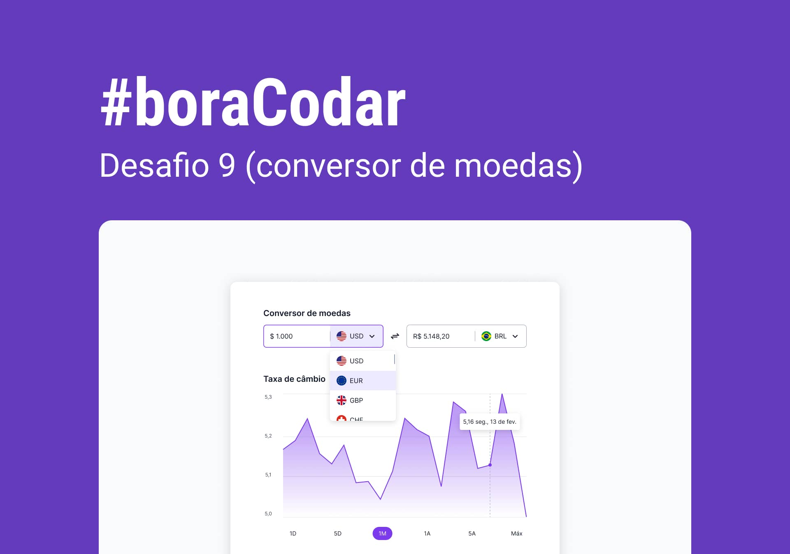

# #boraCodar

    Projetos #boraCodar da Rocketseat  
    <a href="https://boracodar.dev">Acesse o desafio desta semana clicando aqui</a> 
     <table>
    <thead>
        <tr>
            <th align="center">
                 
                

                    <small>#</small>
                

            </th>
            <th align="center">
                 
                
 
                    <small>
                        NAME
                    </small>
                

            </th>
            <th align="left">
                
                
 
                    <small>
                    VISIT
                    </small>
                

            </th>
            <th align="center">
                
                
 
                    <small>
                    PREVIEW
                    </small>
                

            </th>
        </tr>
    </thead>
    <tbody>
        <tr>
            <td>01</td>
            <td><a href="01">Music Player </a></td>
            <td><a href="https://sweydmanaf.github.io/boracodar/01/index.html">ACESSO DIRECTO</a></td>
            <td align="center">
            </td>
        </tr>
        <tr>
            <td>02</td>
            <td><a href="02">Product Card</a></td>
            <td><a href="https://sweydmanaf.github.io/boracodar/02/index.html">ACESSO DIRECTO</a></td>
            <td align="center"></td>
        </tr>
        <tr>
            <td>03</td>
            <td><a href="03">Botões e Cursores</a></td>
            <td><a href="https://sweydmanaf.github.io/boracodar/03/index.html">ACESSO DIRECTO</a></td>
            <td align="center"></td>
        </tr>
        <tr>
            <td>04</td>
            <td><a href="04">Chat</a></td>
            <td><a href="https://sweydmanaf.github.io/boracodar/04/index.html">ACESSO DIRECTO</a></td>
            <td align="center"></td>
        </tr>
        <tr>
            <td>05</td>
            <td><a href="05">Calculadora</a></td>
            <td><a href="https://sweydmanaf.github.io/boracodar/05/index.html">ACESSO DIRECTO</a></td>
            <td align="center"></td>
        </tr>
        <tr>
            <td>06</td>
            <td><a href="06">Cartão de embarque</a></td>
            <td><a href="https://sweydmanaf.github.io/boracodar/06/index.html">ACESSO DIRECTO</a></td>
            <td align="center" ></td>
        </tr>
        <tr>
            <td>07</td>
            <td><a href="07">Site para encontrar seu bloco no carnaval</a></td>
            <td><a href="https://sweydmanaf.github.io/boracodar/07/index.html">ACESSO DIRECTO</a></td>
            <td align="center" ></td>
        </tr>
        <tr>
            <td>09</td>
            <td><a href="09">Conversor de moedas</a></td>
            <td><a href="https://sweydmanaf.github.io/boracodar/09/index.html">ACESSO DIRECTO</a></td>
            <td align="center" ></td>
        </tr>
    </tbody>
</table>

